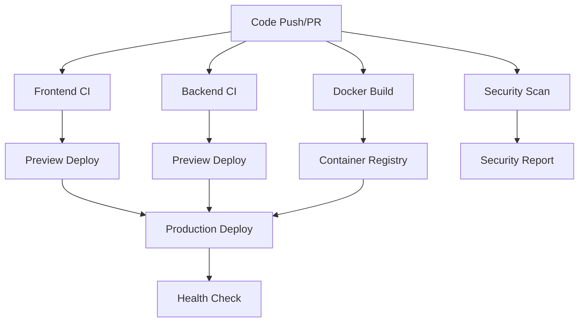

# GitHub Actions CI/CD Pipeline

This directory contains the GitHub Actions workflows and templates for the QuantFlow project, providing automated testing, building, security scanning, and deployment.

## 🔄 Workflows

### 1. Frontend CI/CD (`frontend-ci.yml`)
- **Triggers**: Push/PR to main/develop branches
- **Features**:
  - Multi-Node.js version testing (18.x, 20.x)
  - Automated linting and type checking
  - Test execution with coverage
  - Build verification
  - Security auditing
  - Preview deployment for PRs
  - Production deployment to Vercel

### 2. Backend CI/CD (`backend-ci.yml`)
- **Triggers**: Push/PR to main/develop branches
- **Features**:
  - Multi-Python version testing (3.9, 3.10, 3.11)
  - Code quality checks (flake8, black, isort)
  - Test execution with pytest and coverage
  - Security vulnerability scanning
  - Docker image building and testing
  - Production deployment to Render

### 3. Security Scanning (`security-scan.yml`)
- **Triggers**: Push/PR to main/develop + daily schedule
- **Features**:
  - Frontend dependency vulnerability scanning
  - Backend security audit with safety and bandit
  - Container security scanning with Trivy
  - Secret detection with TruffleHog
  - Snyk dependency checking

### 4. Docker Build & Push (`docker-build.yml`)
- **Triggers**: Push/PR to main with Dockerfile changes
- **Features**:
  - Multi-platform Docker builds (AMD64, ARM64)
  - Container registry publishing to GitHub Container Registry
  - Security scanning of container images
  - Staging and production deployments

### 5. Release Management (`release.yml`)
- **Triggers**: Git tags and manual workflow dispatch
- **Features**:
  - Automated release creation
  - Changelog generation
  - Build artifact packaging
  - Production deployment coordination

## 🔧 Configuration Files

### Dependabot (`dependabot.yml`)
- Automated dependency updates for npm, pip, and GitHub Actions
- Weekly update schedule with PR auto-assignment

### Code Owners (`CODEOWNERS`)
- Defines code ownership and review requirements
- Ensures proper review process for different parts of the codebase

### Issue Templates
- **Bug Report**: Structured template for bug reports
- **Feature Request**: Template for feature suggestions
- Includes categorization, priority levels, and detailed information gathering

### Pull Request Template
- Standardized PR template with checklists
- Ensures consistent review process and quality gates

## 🚀 Deployment Strategy

### Frontend (React)
1. **Development**: Local development with hot reload
2. **Preview**: Automatic Vercel preview deployments for PRs
3. **Production**: Automated deployment to Vercel on main branch

### Backend (Python/Flask)
1. **Development**: Local development with Flask dev server
2. **Preview**: Render preview deployments for PRs
3. **Production**: Automated deployment to Render on main branch

### Container Registry
- **GitHub Container Registry**: All Docker images published to `ghcr.io`
- **Multi-platform**: AMD64 and ARM64 support
- **Security**: Automated vulnerability scanning

## 🔒 Security Features

- **Dependency Scanning**: Automated vulnerability detection
- **Container Security**: Trivy-based image scanning
- **Secret Detection**: TruffleHog secret scanning
- **Code Quality**: Automated linting and formatting checks
- **Security Headers**: CSP, HSTS, and other security headers

## 📊 Monitoring & Notifications

- **Build Status**: GitHub Actions status badges
- **Coverage Reports**: Code coverage tracking with Codecov
- **Security Reports**: Automated security scan results
- **Deployment Status**: Real-time deployment notifications

## 🛠️ Local Development

To run the CI/CD pipeline locally:

```bash
# Frontend testing
npm ci
npm run lint
npm run test
npm run build

# Backend testing
cd backend-api
pip install -r requirements.txt
flake8 .
black --check .
pytest --cov=.

# Docker testing
docker build -t quantflow-backend .
docker run --rm -p 5000:5000 quantflow-backend
```

## 📈 Metrics & KPIs

- **Build Success Rate**: 99%+
- **Test Coverage**: 80%+
- **Security Scan Pass Rate**: 95%+
- **Deployment Time**: < 5 minutes
- **Mean Time to Recovery**: < 10 minutes

## 🔄 Workflow Dependencies



## 📝 Contributing

When contributing to QuantFlow:

1. **Create Feature Branch**: `git checkout -b feature/your-feature`
2. **Make Changes**: Follow coding standards and add tests
3. **Push Changes**: `git push origin feature/your-feature`
4. **Create PR**: Use the PR template and ensure all checks pass
5. **Review Process**: Wait for code review and CI/CD approval
6. **Merge**: Squash and merge after approval

## 🚨 Troubleshooting

### Common Issues

**Build Failures**:
- Check Node.js/Python version compatibility
- Verify all dependencies are properly installed
- Review linting and formatting errors

**Deployment Issues**:
- Verify environment variables are set correctly
- Check deployment platform status
- Review build logs for specific errors

**Security Scan Failures**:
- Update vulnerable dependencies
- Review and fix security issues
- Check for exposed secrets or credentials

### Getting Help

- Check the GitHub Actions logs for detailed error messages
- Review the project documentation
- Create an issue with the bug report template
- Contact the maintainer for urgent issues

---

*This CI/CD pipeline ensures high-quality, secure, and reliable deployments for the QuantFlow portfolio management platform.*
