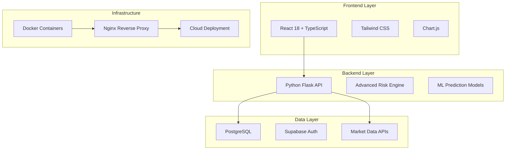

<div align="center">

# QuantFlow

**Advanced Portfolio Management & Risk Analysis Platform**

[](https://reactjs.org/)
[](https://www.typescriptlang.org/)
[](https://www.python.org/)
[](https://flask.palletsprojects.com/)
[](https://www.docker.com/)
[](https://www.postgresql.org/)

[](https://opensource.org/licenses/MIT)
[](http://makeapullrequest.com)
[](https://github.com/pratham-aggr/quantflow/graphs/contributors)

</div>

---

## What is QuantFlow?

QuantFlow is a comprehensive financial technology platform that provides **institutional-grade portfolio management**, **advanced risk analysis**, and **automated rebalancing** capabilities. Built with modern microservices architecture and containerized deployment, it offers real-time market data integration, sophisticated risk modeling, and intelligent portfolio optimization.

### 🎯 Key Highlights

- **Real-time Portfolio Tracking** with live market data
- **Advanced Risk Analysis** with Monte Carlo simulations
- **Machine Learning** powered volatility predictions
- **Automated Rebalancing** with tax-loss harvesting
- **Enterprise Security** with JWT authentication
- **Docker Ready** for easy deployment

---

## 🏗️ Architecture



---

## 🛠️ Technology Stack

### Frontend Technologies
<table>
<tr>
<td align="center" width="20%">

<br/><b>React 18</b>
</td>
<td align="center" width="20%">

<br/><b>TypeScript</b>
</td>
<td align="center" width="20%">

<br/><b>Tailwind CSS</b>
</td>
<td align="center" width="20%">

<br/><b>Chart.js</b>
</td>
<td align="center" width="20%">

<br/><b>Axios</b>
</td>
</tr>
</table>

### Backend Technologies
<table>
<tr>
<td align="center" width="16%">

<br/><b>Python 3.9+</b>
</td>
<td align="center" width="16%">

<br/><b>Flask 2.3+</b>
</td>
<td align="center" width="16%">

<br/><b>NumPy</b>
</td>
<td align="center" width="16%">

<br/><b>Pandas</b>
</td>
<td align="center" width="16%">

<br/><b>SciPy</b>
</td>
<td align="center" width="16%">

<br/><b>scikit-learn</b>
</td>
</tr>
</table>

### Infrastructure & DevOps
<table>
<tr>
<td align="center" width="20%">

<br/><b>Docker</b>
</td>
<td align="center" width="20%">

<br/><b>Nginx</b>
</td>
<td align="center" width="20%">

<br/><b>PostgreSQL</b>
</td>
<td align="center" width="20%">

<br/><b>Supabase</b>
</td>
<td align="center" width="20%">

<br/><b>Vercel</b>
</td>
</tr>
</table>

---

## 🚀 Quick Start

### Option 1: Docker (Recommended)

```bash
# Clone the repository
git clone https://github.com/pratham-aggr/quantflow.git
cd quantflow

# Start the application
docker-compose up -d

# Access the application
# Frontend: http://localhost:3000
# Backend: http://localhost:5000
```

### Option 2: Manual Setup

```bash
# Frontend
npm install
npm start

# Backend (in another terminal)
cd backend-api
pip install -r requirements.txt
python app.py
```

---

## 📦 Docker Deployment

### Development Environment

```bash
# Start development environment
make dev

# View logs
make logs

# Health check
make health
```

### Production Environment

```bash
# Production deployment
make prod

# Scale services
docker-compose -f docker-compose.prod.yml up -d --scale backend=3
```

### Available Commands

| Command | Description |
|---------|-------------|
| `make dev` | Start development environment |
| `make prod` | Start production environment |
| `make build` | Build all Docker images |
| `make logs` | View application logs |
| `make clean` | Clean up containers and images |
| `make health` | Check service health |

---

## 🔧 Features

### 📊 Portfolio Management
- **Real-time Tracking** - Live portfolio monitoring with market data
- **Multi-Asset Support** - Stocks, ETFs, bonds, and alternative investments
- **Performance Analytics** - Comprehensive performance metrics and attribution
- **Allocation Visualization** - Interactive portfolio allocation charts

### 🎯 Risk Analysis Engine
- **Advanced Metrics** - VaR, CVaR, Sharpe Ratio, Beta, Alpha calculations
- **Monte Carlo Simulation** - Scenario analysis and stress testing
- **Correlation Analysis** - Asset correlation and diversification scoring
- **ML Predictions** - Machine learning-based volatility forecasting
- **Stress Testing** - Portfolio stress testing under various scenarios

### ⚖️ Automated Rebalancing
- **Smart Algorithms** - Intelligent rebalancing strategies
- **Tax Optimization** - Tax-loss harvesting and optimization
- **Custom Rules** - User-defined rebalancing criteria
- **What-if Analysis** - Scenario testing for rebalancing strategies

### 📈 Market Intelligence
- **Real-time Data** - Live market quotes and historical data
- **News Integration** - Financial news aggregation and sentiment analysis
- **Technical Analysis** - Technical indicators and trend analysis
- **Sentiment Scoring** - Market sentiment analysis and scoring

---

## 🔌 API Documentation

### Authentication
```http
POST /api/auth/login
POST /api/auth/register
POST /api/auth/refresh
```

### Portfolio Management
```http
GET    /api/portfolio/{id}
POST   /api/portfolio
PUT    /api/portfolio/{id}
DELETE /api/portfolio/{id}
```

### Risk Analysis
```http
POST /api/risk/analyze
POST /api/risk/monte-carlo
POST /api/risk/correlation
POST /api/risk/ml-prediction
```

### Market Data
```http
GET /api/market-data/quote/{symbol}
GET /api/market-data/historical/{symbol}
GET /api/market-data/news
```

---

## 🤝 Contributing

We welcome contributions from developers, financial analysts, and open-source enthusiasts!

### 🚀 Quick Contribution Guide

1. **Fork the repository**
   ```bash
   # Fork on GitHub, then clone your fork
   git clone https://github.com/your-username/quantflow.git
   cd quantflow
   ```

2. **Set up development environment**
   ```bash
   # Using Docker (recommended)
   make dev
   ```

3. **Create a feature branch**
   ```bash
   git checkout -b feature/your-awesome-feature
   ```

4. **Make your changes and test**
   ```bash
   # Run tests
   npm test
   cd backend-api && python -m pytest
   ```

5. **Submit a pull request**
   ```bash
   git add .
   git commit -m "Add your awesome feature"
   git push origin feature/your-awesome-feature
   ```

### 🎯 Areas for Contribution

| Area | Technologies | Description |
|------|-------------|-------------|
| **Frontend** | React, TypeScript, Tailwind | UI components, performance optimization |
| **Backend** | Python, Flask, NumPy | Financial algorithms, risk models |
| **DevOps** | Docker, Nginx, CI/CD | Deployment automation, monitoring |
| **Documentation** | Markdown, API docs | User guides, technical documentation |
| **Testing** | Jest, Pytest | Unit tests, integration tests |

---

## 🔒 Security

QuantFlow implements enterprise-grade security measures:

- **🔐 JWT Authentication** - Secure token-based authentication
- **🛡️ Role-based Access** - Granular permission system
- **🔒 Data Encryption** - TLS 1.3 for data in transit
- **🚫 Input Validation** - Comprehensive input sanitization
- **⚡ Rate Limiting** - API rate limiting and DDoS protection
- **🔐 Security Headers** - CSP, HSTS, and security headers

---

## 📊 Performance

The platform is optimized for high-performance financial applications:

- **⚡ Multi-layer Caching** - Redis and application-level caching
- **🗄️ Database Optimization** - Indexed queries and connection pooling
- **🌐 CDN Integration** - Global content delivery network
- **⚖️ Load Balancing** - Horizontal scaling capabilities
- **📈 Real-time Metrics** - Performance monitoring and alerting

---

## 📈 Roadmap

- [ ] **Advanced Portfolio Optimization** - Modern portfolio theory algorithms
- [ ] **Real-time Collaboration** - Multi-user portfolio management
- [ ] **Mobile Application** - iOS and Android apps
- [ ] **Advanced Analytics** - Custom reporting and dashboards
- [ ] **Data Provider Integration** - Multiple market data sources
- [ ] **AI/ML Enhancements** - Advanced machine learning models

---

## 📄 License

This project is licensed under the **MIT License** - see the [LICENSE](LICENSE) file for details.

---

## 💬 Support

- **📚 Documentation**: [GitHub Wiki](https://github.com/pratham-aggr/quantflow/wiki)
- **🐛 Issues**: [GitHub Issues](https://github.com/pratham-aggr/quantflow/issues)
- **💬 Discussions**: [GitHub Discussions](https://github.com/pratham-aggr/quantflow/discussions)

---

<div align="center">

**Made with ❤️ by [Pratham Aggarwal](https://github.com/pratham-aggr)**

[](https://github.com/pratham-aggr/quantflow/stargazers)
[](https://github.com/pratham-aggr/quantflow/network)
[](https://github.com/pratham-aggr/quantflow/watchers)

⭐ **Star this repository if you found it helpful!**

</div>