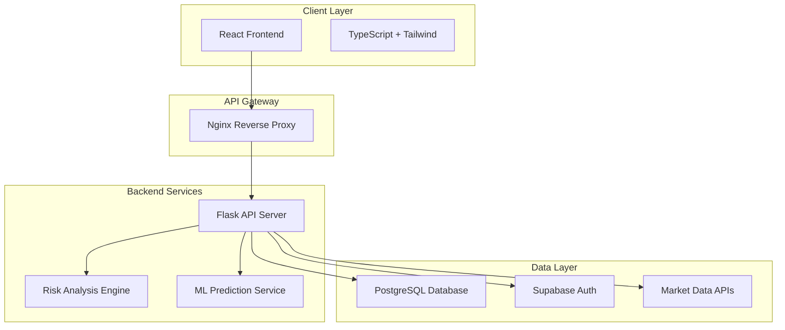

<div align="center">

# QuantFlow

**Advanced Portfolio Management & Risk Analysis Platform**

[](https://reactjs.org/)
[](https://www.typescriptlang.org/)
[](https://www.python.org/)
[](https://flask.palletsprojects.com/)
[](https://www.docker.com/)

[](https://opensource.org/licenses/MIT)
[](http://makeapullrequest.com)
[](https://github.com/pratham-aggr/quantflow/stargazers)

</div>

---

## Overview

QuantFlow is a comprehensive financial technology platform that provides institutional-grade portfolio management, advanced risk analysis, and automated rebalancing capabilities. Built with modern microservices architecture and containerized deployment, it offers real-time market data integration, sophisticated risk modeling, and intelligent portfolio optimization.

### Key Features

- **Real-time Portfolio Tracking** with live market data integration
- **Advanced Risk Analysis** with Monte Carlo simulations and ML predictions
- **Automated Rebalancing** with intelligent algorithms and tax optimization
- **Enterprise Security** with JWT authentication and role-based access
- **Docker Ready** for seamless deployment and scaling
- **Modern Architecture** with microservices and cloud-native design

---

## Architecture



---

## Technology Stack

### Frontend
<table>
<tr>
<td align="center" width="20%">

<br/><b>React 18</b>
<br/><small>Modern UI Framework</small>
</td>
<td align="center" width="20%">

<br/><b>TypeScript</b>
<br/><small>Type Safety</small>
</td>
<td align="center" width="20%">

<br/><b>Tailwind CSS</b>
<br/><small>Utility-first CSS</small>
</td>
<td align="center" width="20%">

<br/><b>Chart.js</b>
<br/><small>Data Visualization</small>
</td>
<td align="center" width="20%">

<br/><b>Axios</b>
<br/><small>HTTP Client</small>
</td>
</tr>
</table>

### Backend
<table>
<tr>
<td align="center" width="16%">

<br/><b>Python 3.9+</b>
<br/><small>Core Language</small>
</td>
<td align="center" width="16%">

<br/><b>Flask 2.3+</b>
<br/><small>Web Framework</small>
</td>
<td align="center" width="16%">

<br/><b>NumPy</b>
<br/><small>Numerical Computing</small>
</td>
<td align="center" width="16%">

<br/><b>Pandas</b>
<br/><small>Data Analysis</small>
</td>
<td align="center" width="16%">

<br/><b>SciPy</b>
<br/><small>Scientific Computing</small>
</td>
<td align="center" width="16%">

<br/><b>scikit-learn</b>
<br/><small>Machine Learning</small>
</td>
</tr>
</table>

### Infrastructure
<table>
<tr>
<td align="center" width="20%">

<br/><b>Docker</b>
<br/><small>Containerization</small>
</td>
<td align="center" width="20%">

<br/><b>Nginx</b>
<br/><small>Reverse Proxy</small>
</td>
<td align="center" width="20%">

<br/><b>PostgreSQL</b>
<br/><small>Database</small>
</td>
<td align="center" width="20%">

<br/><b>Supabase</b>
<br/><small>Backend as a Service</small>
</td>
<td align="center" width="20%">

<br/><b>Vercel</b>
<br/><small>Frontend Hosting</small>
</td>
</tr>
</table>

---

## Quick Start

### Prerequisites
- Docker and Docker Compose
- Node.js 18+ (for development)
- Python 3.9+ (for development)

### Docker Deployment (Recommended)

```bash
# Clone the repository
git clone https://github.com/pratham-aggr/quantflow.git
cd quantflow

# Start the application
docker-compose up -d

# Access the application
# Frontend: http://localhost:3000
# Backend: http://localhost:5000
```

### Manual Development Setup

```bash
# Frontend
npm install
npm start

# Backend (in another terminal)
cd backend-api
pip install -r requirements.txt
python app.py
```

---

## Docker Commands

| Command | Description |
|---------|-------------|
| `make dev` | Start development environment |
| `make prod` | Start production environment |
| `make build` | Build all Docker images |
| `make logs` | View application logs |
| `make clean` | Clean up containers and images |
| `make health` | Check service health |

---

## Core Features

### Portfolio Management
- **Real-time Tracking** - Live portfolio monitoring with market data
- **Multi-Asset Support** - Stocks, ETFs, bonds, and alternative investments
- **Performance Analytics** - Comprehensive performance metrics and attribution
- **Allocation Visualization** - Interactive portfolio allocation charts

### Risk Analysis Engine
- **Advanced Metrics** - VaR, CVaR, Sharpe Ratio, Beta, Alpha calculations
- **Monte Carlo Simulation** - Scenario analysis and stress testing
- **Correlation Analysis** - Asset correlation and diversification scoring
- **ML Predictions** - Machine learning-based volatility forecasting
- **Stress Testing** - Portfolio stress testing under various scenarios

### Automated Rebalancing
- **Smart Algorithms** - Intelligent rebalancing strategies
- **Tax Optimization** - Tax-loss harvesting and optimization
- **Custom Rules** - User-defined rebalancing criteria
- **What-if Analysis** - Scenario testing for rebalancing strategies

### Market Intelligence
- **Real-time Data** - Live market quotes and historical data
- **News Integration** - Financial news aggregation and sentiment analysis
- **Technical Analysis** - Technical indicators and trend analysis
- **Sentiment Scoring** - Market sentiment analysis and scoring

---

## API Endpoints

### Authentication
```http
POST /api/auth/login          # User authentication
POST /api/auth/register       # User registration
POST /api/auth/refresh        # Token refresh
```

### Portfolio Management
```http
GET    /api/portfolio/{id}    # Get portfolio details
POST   /api/portfolio         # Create new portfolio
PUT    /api/portfolio/{id}    # Update portfolio
DELETE /api/portfolio/{id}    # Delete portfolio
```

### Risk Analysis
```http
POST /api/risk/analyze        # Comprehensive risk analysis
POST /api/risk/monte-carlo    # Monte Carlo simulation
POST /api/risk/correlation    # Correlation analysis
POST /api/risk/ml-prediction  # ML-based predictions
```

### Market Data
```http
GET /api/market-data/quote/{symbol}        # Real-time quotes
GET /api/market-data/historical/{symbol}   # Historical data
GET /api/market-data/news                  # Market news feed
```

---

## Contributing

We welcome contributions from developers, financial analysts, and open-source enthusiasts!

### Development Workflow

1. **Fork and Clone**
   ```bash
   git clone https://github.com/your-username/quantflow.git
   cd quantflow
   ```

2. **Set up Environment**
   ```bash
   # Using Docker (recommended)
   make dev
   ```

3. **Create Feature Branch**
   ```bash
   git checkout -b feature/your-feature-name
   ```

4. **Make Changes and Test**
   ```bash
   # Run tests
   npm test
   cd backend-api && python -m pytest
   ```

5. **Submit Pull Request**
   ```bash
   git add .
   git commit -m "Add your feature"
   git push origin feature/your-feature-name
   ```

### Contribution Areas

| Area | Technologies | Focus |
|------|-------------|-------|
| **Frontend** | React, TypeScript, Tailwind | UI components, performance optimization |
| **Backend** | Python, Flask, NumPy | Financial algorithms, risk models |
| **DevOps** | Docker, Nginx, CI/CD | Deployment automation, monitoring |
| **Documentation** | Markdown, API docs | User guides, technical documentation |
| **Testing** | Jest, Pytest | Unit tests, integration tests |

---

## Security & Performance

### Security Features
- **JWT Authentication** - Secure token-based authentication
- **Role-based Access** - Granular permission system
- **Data Encryption** - TLS 1.3 for data in transit
- **Input Validation** - Comprehensive input sanitization
- **Rate Limiting** - API rate limiting and DDoS protection

### Performance Optimizations
- **Multi-layer Caching** - Redis and application-level caching
- **Database Optimization** - Indexed queries and connection pooling
- **CDN Integration** - Global content delivery network
- **Load Balancing** - Horizontal scaling capabilities
- **Real-time Metrics** - Performance monitoring and alerting

---

## Roadmap

- [ ] **Advanced Portfolio Optimization** - Modern portfolio theory algorithms
- [ ] **Real-time Collaboration** - Multi-user portfolio management
- [ ] **Mobile Application** - iOS and Android apps
- [ ] **Advanced Analytics** - Custom reporting and dashboards
- [ ] **Data Provider Integration** - Multiple market data sources
- [ ] **AI/ML Enhancements** - Advanced machine learning models

---

## License

This project is licensed under the **MIT License** - see the [LICENSE](LICENSE) file for details.

---

## Support

- **Documentation**: [GitHub Wiki](https://github.com/pratham-aggr/quantflow/wiki)
- **Issues**: [GitHub Issues](https://github.com/pratham-aggr/quantflow/issues)
- **Discussions**: [GitHub Discussions](https://github.com/pratham-aggr/quantflow/discussions)

---

<div align="center">

**Made with ❤️ by [Pratham Aggarwal](https://github.com/pratham-aggr)**

[](https://github.com/pratham-aggr/quantflow/stargazers)
[](https://github.com/pratham-aggr/quantflow/network)

⭐ **Star this repository if you found it helpful!**

</div>